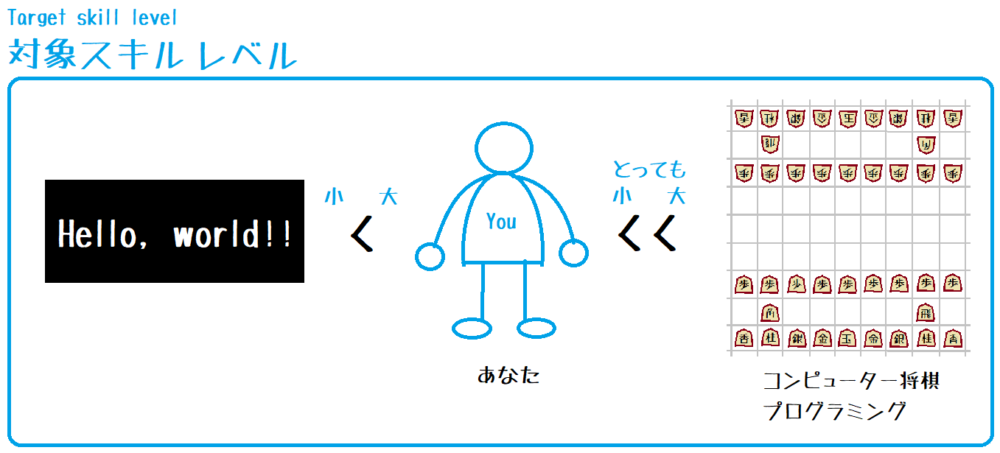
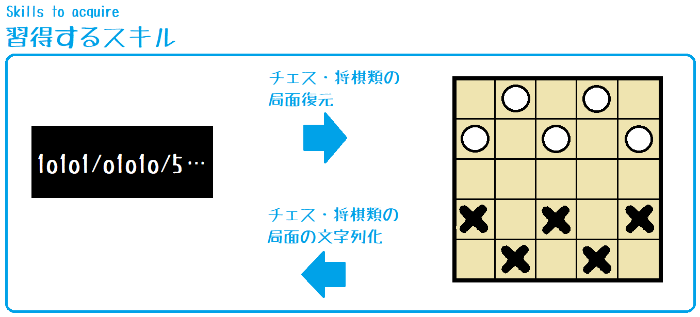

# Kifuwarabe's pyon-pyon-game

  

コンピューター将棋をいきなり作るのは難しいし……、という人のために **プログラムするのが楽な架空のゲーム** を用意しようぜ、という趣旨だぜ☆（＾～＾）  

* × ゲームが簡単
* 〇 プログラムするのが楽

ほんとうに楽かは知らん☆（＾～＾）さっき考案して そう思いたいだけだぜ☆（＾～＾）  

  

このゲームを実装しても、コンピューター将棋制作の練習にはならない☆（＾～＾）あれは めっちゃむずかしい☆（＾～＾）  
挫折する前に 思い出作りをするための 寄り道みたいなもんだぜ☆（＾～＾）  

チェッカーと ダイヤモンドゲームのアイデアをパクった、プログラム・スキルの手ならし目的の習作と思えだぜ☆（＾～＾）  
利用ライセンスは MIT☆（＾～＾）  
隙あれば儲けようと思うが、訴えられたら なんとかしろだぜ☆（＾～＾）  

* [ぴょんぴょんゲームのルール](./doc/rule.md)
* [エンジン側のプロトコルを作ろう](./doc/engine-side-protocol.md)
* [実装のヒント](./doc/impl.md)

## Run

```shell
cargo run
```