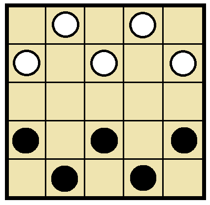
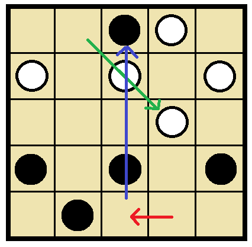

# Engine side protocol (E)

## Layer. 1

ユニバーサル・ぴょん・インターフェース(UPI) も作ってしまおう☆（＾～＾）  
まずはこの `Layer. 1` の実装を目指せだぜ☆（＾～＾）  
このレイヤーを崩すことなく `Layer. 2` で拡張されると思ってくれだぜ☆（＊＾～＾＊）  

`Layer. 1` では、通信対戦はできないが、  
ローカルPCでコンピューターと開発者が対局できるところまでをやるぜ☆（＾～＾）  

コンピューター・チェスの USI と、Stockfishの作者原案(今は散逸？)や将棋所の SFEN を参考にしているぜ☆（＾～＾）  

### E1-1. Address

  

盤の番地は 左上を原点として、右方向へ小文字で a, b, c...☆（＾～＾）  
下方向へ 1, 2, 3... でいいだろ☆（＾～＾）  

### E1-2. Move

  

```plain
b5c3
```

指し手は 移動元と、移動先の２つな☆（＾～＾）  
途中の経路は　どうでもいいことにするぜ☆（＾～＾）

```plain
b5c3 b2d4
```

半角スペース１個で区切って 指し手をつなげろだぜ☆（＾～＾）

### E1-2-1. Resign

```plain
resign
```

投了は resign を送れだぜ☆（＾～＾）  

### E1-2-2. Draw

```plain
draw
```

このゲームは勝利宣言はなくて、千日手宣言だけできるんで、 draw を送れだぜ☆（＾～＾）  

### E1-3. Startpos

  

```plain
position startpos
```

この局面は `position startpos` と示せだぜ☆（＾～＾）

### E1-4. Xfen

  

もし途中局面から始めるなら、

```plain
position xfen xxx2/2oo1/5/1xx2/o1oo1 x
```

と示せだぜ☆（＾～＾）  
左上から、黒石なら `x`、 白石なら `o`、 スペースは連続している数を入れろだぜ☆（＾～＾）  
行は `/` で区切ること☆（＾～＾）  
最後に1個浮いているアルファベットは、次に指すのがどちらかを表しているぜ☆（＾～＾）  

### E1-5. Position and moves

  

```plain
position startpos moves d5c5 b1d3 c5c1
```

対局中のやりとりで局面送るときは、この方法だぜ☆（＾～＾）  
初期局面 `moves` 指し手のリスト☆（＾～＾）  

一手指すごとに文字列が伸びて丸ごと送られてくるのが嫌かもしれないが、  
デバッグのとき 一行丸ごとコピー でリプレイできるから、楽なんだぜ☆（＾～＾）  

### E1-6. Go

```plain
go
```

プログラムに次の一手を指させるときは、 `go` と打鍵しろだぜ☆（＾～＾）  
持ち時間のような細かな仕様は 決めてないぜ☆（＊＾～＾＊）

コンピューターからの応答は、 `bestmove 指し手` だぜ☆（＾～＾）

```plain
bestmove b1d3
```

```plain
bestmove resign
```

### E1-7. (Option) Pos

ここからは、任意の開発用コマンドだぜ☆（＾～＾）

```plain
pos
```

盤面や、局面の情報を表示しろだぜ☆（＾～＾）  
以下はわたしに分かりやすい表示例なだけなんで、好きにしろだぜ☆（＾～＾）

```plain
[0 move(s) | Go! x | 0 repeat(s)]

  +---+---+---+---+---+
1 |   | o |   | o |   |
  +---+---+---+---+---+
2 | o |   | o |   | o |
  +---+---+---+---+---+
3 |   |   |   |   |   |
  +---+---+---+---+---+
4 | x |   | x |   | x |
  +---+---+---+---+---+
5 |   | x |   | x |   |
  +---+---+---+---+---+
    a   b   c   d   e
```

### E1-8. (Option) Xfen

```plain
xfen
```

fen はチェスのやつなんだが、 将棋は sfen、 どうぶつしょうぎは dfen、 ぴょんは pfen とか  
やってると頭こんがらがるんで、  
pfen ではなく、一緒くたに xfen とでもしておこうぜ☆（＾～＾）？  
このコマンドを打鍵したら……☆（＾～＾）  

```plain
position startpos moves
```

ポジション・コマンドを返せだぜ☆（＾～＾） すぐ使うだろ☆（＾～＾）  

### E1-9. (Option) Do

```plain
do d5c5
```

人間が一手さすぜ☆（＾～＾） GUI がないときに ちょちょっと指したいだろ☆（＾～＾）  

### E1-10. (Option) Undo

```plain
undo
```

指した手を戻すぜ☆（＾～＾）  
`do d5c5` したのなら `do c5d5` すれば戻るじゃないか、と思うかもしれないが  
練習と思えだぜ☆（＊＾～＾＊）  

## UXI Example

チェスは USI、 将棋には USI プロトコルがある。  
ただ、ゲームごとにアルファベットを付けていては あと 24文字で無くなってしまうため、
X を その他の何か、ぐらいの意味で使って UXI という名前にすることにする。  

### position

例えば以下の局面を 記録／再開 することを考えよう。  


データは１行で持つのが 扱いやすい。  
Forsyth-Edwards 記法を真似て 以下のようにする。  

```plain
1o1o1/o1o1o/5/x1x1x/1x1x1 x
```

  

仕組みとしては、１行ずつ並べ、行の区切りに `/` を入れ、  
駒の名前を１文字で、空白は数字で入れる。  

最後に、次に指す手番を書く。  

これだけあれば、ゲームの保存、再開 ができる。
ただし、棋譜も欲しいという要望はあると思う。これも UCI/USI にあるので真似る。  

  

```plain
1o1o1/o1o1o/5/x1x1x/1x1x1 x moves c4b3
```

末尾に `moves c4b3` を付け、以後の指し手も半角空白区切りでつなげる。  

ここで注意。  

  

筋、段の順で　マスの番号を読み上げるとすると、配列の要素の並びは……、  

  

`+10` で 右の筋に移動し、`x mod 10 + 11` で 下の段の左端に移動する。  
盤を 縦型にするか横型にするか、右から始めるか左から始めるかは  
工夫の余地があるが データ構造を UXI に合わせるよりは  
これぐらいの計算 しろだぜ☆（＾～＾）  
対局が始まったら UXI とか使わないから 時間はケチらなくていい☆（＾～＾）   
