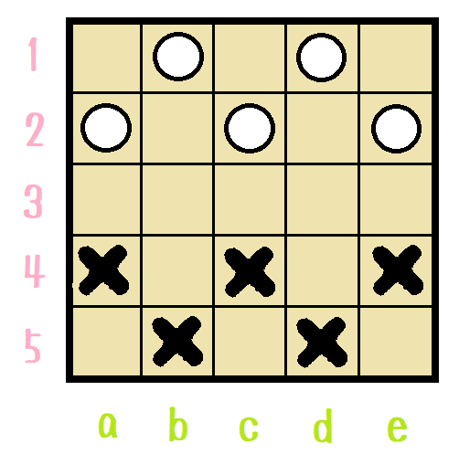
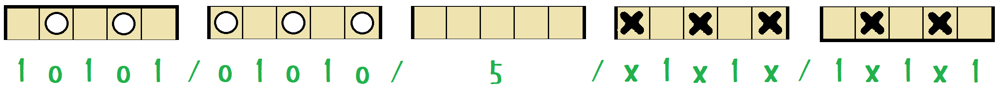
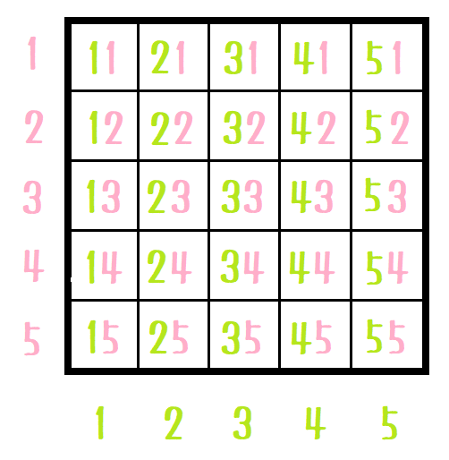

# UXIプロトコルを作ろう

チェスは USI、 将棋には USI プロトコルがある。  
ただ、ゲームごとにアルファベットを付けていては あと 24文字で無くなってしまうため、
X を その他の何か、ぐらいの意味で使って UXI という名前にすることにする。  

## position

例えば以下の局面を 記録／再開 することを考えよう。  



データは１行で持つのが 扱いやすい。  
Forsyth-Edwards 記法を真似て 以下のようにする。  

```plain
1o1o1/o1o1o/5/x1x1x/1x1x1 x
```

  

仕組みとしては、１行ずつ並べ、行の区切りに `/` を入れ、  
駒の名前を１文字で、空白は数字で入れる。  

最後に、次に指す手番を書く。  

これだけあれば、ゲームの保存、再開 ができる。
ただし、棋譜も欲しいという要望はあると思う。これも UCI/USI にあるので真似る。  

  

```plain
1o1o1/o1o1o/5/x1x1x/1x1x1 x moves c4b3
```

末尾に `moves c4b3` を付け、以後の指し手も半角空白区切りでつなげる。  

ここで注意。  

  

筋、段の順で　マスの番号を読み上げるとすると、配列の要素の並びは……、  

  

`+10` で 右の筋に移動し、`x mod 10 + 11` で 下の段の左端に移動する。  
盤を 縦型にするか横型にするか、右から始めるか左から始めるかは  
工夫の余地があるが データ構造を UXI に合わせるよりは  
これぐらいの計算 しろだぜ☆（＾～＾）  
対局が始まったら UXI とか使わないから 時間はケチらなくていい☆（＾～＾）   
