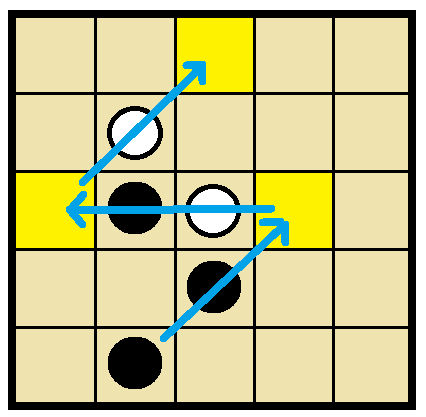

# ぴょんぴょんゲームのルール

コンピューター将棋をいきなり作るのは難しいし……、という人のためのプログラムが楽な架空のゲームだぜ☆（＾～＾）  
プログラム・ソースはまだないが、もしわたしが作るなら Rust 一択だぜ☆（＾～＾）  

ほんとうに楽かは知らん☆（＾～＾）さっき考案して そう思いたいだけだぜ☆（＾～＾）  
このゲームを実装しても、コンピューター将棋制作の練習にはならない☆（＾～＾）あれは めっちゃむずかしい☆（＾～＾）  
挫折する前に 思い出作りをするための 寄り道みたいなもんだぜ☆（＾～＾）  

チェッカーと ダイヤモンドゲームのアイデアをパクった、プログラム・スキルの手ならし目的の習作と思えだぜ☆（＾～＾）  
利用ライセンスは MIT☆（＾～＾）  
隙あれば儲けようと思うが、訴えられたら なんとかしろだぜ☆（＾～＾）  

## Rule 1

  
これが初期配置だぜ☆（＾～＾）  

## Rule 2
勝利条件は……☆（＾～＾）  

### Case 2-1

  

奥の段に全駒を置くと、勝ち☆（＾～＾）  
これは黒勝ちの終了図だな☆（＾～＾）  

### Case 2-2

  

どかないマンには 正面で　オラッ☆！　とやれば　奥にいるのと同じ扱いで勝ちだぜ☆（＾～＾）  

### Case 2-3

自分のターンで 投了 したら負け☆（＾～＾）  
相手が、相手のターンで投了したら こっちの勝ちだぜ☆（＾～＾）  

### Case 2-4

同一局面が過去に2回あったことを指摘できるなら、  
千日手を打開する前に 手番の選手が千日手宣言したら　千日手成立だぜ☆（＾～＾）  
これは コンピューターの立会人がいないときでもできる 実際的な遊び方な☆（＾～＾）  

コンピューターが判定してくれるなら、同一局面が 3回出たら 千日手成立 にしろだぜ☆（＾～＾）  
将棋と違って１回少ない☆（＾～＾） チェスと同じ☆（＾～＾）  

引き分けにするか、次の対局を始める(持将棋)かは 棋戦で決めとけだぜ☆（＾～＾）  

## Rule 3

駒の動かし方を説明しよう☆（＾～＾）  

### Case 3-1

  

駒は１種類しかない☆（＾～＾）　将棋の王さんと同じ８方向に１マス動けるが……☆（＾～＾）  

### Case 3-2

  

隣に駒があれば、おまとめしてポンと飛べるぜ☆（＾～＾）連続飛びも可能☆（＾～＾）

## Rule 4

パスはできない☆（＾～＾）

## Engine side protocol (E) Layer. 1

ユニバーサル・ぴょん・インターフェース(UPI) も作ってしまおう☆（＾～＾）  
まずはこの `Layer. 1` の実装を目指せだぜ☆（＾～＾）  
このレイヤーを崩すことなく `Layer. 2` で拡張されると思ってくれだぜ☆（＊＾～＾＊）  

`Layer. 1` では、通信対戦はできないが、  
ローカルPCでコンピューターと開発者が対局できるところまでをやるぜ☆（＾～＾）  

コンピューター・チェスの USI と、Stockfishの作者原案(今は散逸？)や将棋所の SFEN を参考にしているぜ☆（＾～＾）  

### E1-1. Address

  

盤の番地は 左上を原点として、右方向へ小文字で a, b, c...☆（＾～＾）  
下方向へ 1, 2, 3... でいいだろ☆（＾～＾）  

### E1-2. Move

  

```plain
b5c3
```

指し手は 移動元と、移動先の２つな☆（＾～＾）  
途中の経路は　どうでもいいことにするぜ☆（＾～＾）

```plain
b5c3 b2d4
```

半角スペース１個で区切って 指し手をつなげろだぜ☆（＾～＾）

### E1-2-1. Resign

```plain
resign
```

投了は resign を送れだぜ☆（＾～＾）  

### E1-2-2. Draw

```plain
draw
```

このゲームは勝利宣言はなくて、千日手宣言だけできるんで、 draw を送れだぜ☆（＾～＾）  

### E1-3. Startpos

  

```plain
position startpos
```

この局面は `position startpos` と示せだぜ☆（＾～＾）

### E1-4. Pfen

  

もし途中局面から始めるなら、

```plain
position pfen xxx2/2oo1/5/1xx2/o1oo1 x
```

と示せだぜ☆（＾～＾）  
左上から、黒石なら `x`、 白石なら `o`、 スペースは連続している数を入れろだぜ☆（＾～＾）  
行は `/` で区切ること☆（＾～＾）  
最後に1個浮いているアルファベットは、次に指すのがどちらかを表しているぜ☆（＾～＾）  

### E1-5. Position and moves

  

```plain
position startpos moves d5c5 b1d3 c5c1
```

対局中のやりとりで局面送るときは、この方法だぜ☆（＾～＾）  
初期局面 `moves` 指し手のリスト☆（＾～＾）  

一手指すごとに文字列が伸びて丸ごと送られてくるのが嫌かもしれないが、  
デバッグのとき 一行丸ごとコピー でリプレイできるから、楽なんだぜ☆（＾～＾）  

### E1-6. Go

```plain
go
```

プログラムに次の一手を指させるときは、 `go` と打鍵しろだぜ☆（＾～＾）  
持ち時間のような細かな仕様は 決めてないぜ☆（＊＾～＾＊）

コンピューターからの応答は、 `bestmove 指し手` だぜ☆（＾～＾）

```plain
bestmove b1d3
```

```plain
bestmove resign
```

### E1-7. (Option) Pos

ここからは、任意の開発用コマンドだぜ☆（＾～＾）

```plain
pos
```

盤面や、局面の情報を表示しろだぜ☆（＾～＾）  
以下はわたしに分かりやすい表示例なだけなんで、好きにしろだぜ☆（＾～＾）

```plain
[0 move(s) | Go! x | 0 repeat(s)]

  +---+---+---+---+---+
1 |   | o |   | o |   |
  +---+---+---+---+---+
2 | o |   | o |   | o |
  +---+---+---+---+---+
3 |   |   |   |   |   |
  +---+---+---+---+---+
4 | x |   | x |   | x |
  +---+---+---+---+---+
5 |   | x |   | x |   |
  +---+---+---+---+---+
    a   b   c   d   e
```

### E1-8. (Option) Xfen

```plain
xfen
```

fen はチェスのやつなんだが、 将棋は sfen、 どうぶつしょうぎは dfen、 ぴょんは pfen とか  
やってると頭こんがらがるんで、  
一緒くたに xfen とでもしておこうぜ☆（＾～＾）？  
このコマンドを打鍵したら……☆（＾～＾）  

```plain
position startpos moves
```

ポジション・コマンドを返せだぜ☆（＾～＾） すぐ使うだろ☆（＾～＾）  

### E1-9. (Option) Do

```plain
do d5c5
```

人間が一手さすぜ☆（＾～＾） GUI がないときに ちょちょっと指したいだろ☆（＾～＾）  

### E1-10. (Option) Undo

```plain
undo
```

指した手を戻すぜ☆（＾～＾）  
`do d5c5` したのなら `do c5d5` すれば戻るじゃないか、と思うかもしれないが  
練習と思えだぜ☆（＊＾～＾＊）  

## (挑戦課題) 次のステップ

もし簡単に作れたのなら、こんな応用もあるぜ☆（＾～＾）  

  

玉以外の駒をランダム配置して ぴょんぴょん しろだぜ☆（＾～＾）  
ぴょんぴょんできないときは将棋の駒の動き、ぴょんぴょん する方向は８方向でいい☆（＾～＾）  
相手の駒を取るのは禁止な☆（＾～＾）  
たぶんゲームにならない組み合わせもあると思うぜ☆（＾～＾）そんときは両者負けな☆（＾～＾）  

玉は 利きに飛び込んでいるのが感覚的に気持ち悪かったので抜けだぜ☆（＾～＾）  
初心者向けのアドバイスとしては、香飛角の長い利きの駒はむずかしいので やめといてもいいぜ☆（＾～＾）  
もっと こうした方がいいというアイデアがあれば勝手に実装しろだぜ、  
それ多分むずかしいばっかりだぜ☆ｍ９（＾～＾）  
